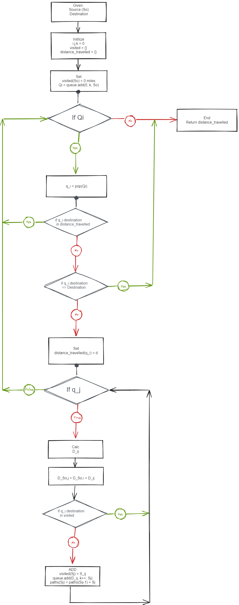

# algo-optimum-path
Author:  Erin James Wills, ejw.data@gmail.com  

  

<cite>Photo by <a href="https://unsplash.com/@geojango_maps?utm_source=unsplash&utm_medium=referral&utm_content=creditCopyText">GeoJango Maps</a> on <a href="https://unsplash.com/photos/Z8UgB80_46w?utm_source=unsplash&utm_medium=referral&utm_content=creditCopyText">Unsplash</a></cite>

 

## Overview  

  
This repo explores algorithms that can help identify optimum paths.  Initially, I will include only distance as my optimizing criteria but I will continue to add features for improving the calculation such as population based optimization, minimum distance between cities or total cities visited per trip.  Initially I will only calculate the routes based on a crude method (search of all options) but I intend to use more optimized methods like Dijkstra's Algorithm in the future.

## Status  
1.  Currently have a basic model working that finds shortest distance - need utilize haversine distance instead of euclidean
1.  Need to optimize for greatest population and allow for distance to vary but set limit for the maximum number of cities visited
1.  Don't think the basic model will find optimum for more complicated problems since it is finding the next minimum distance instead of looking at the total trip distance.  A crude model that finds all combinations could find the best solution but this would be very processing heavy.  Need to use an algorithm like Dijkstra or A*
1.  Simple Dijkstra example is working but customizations are in progress

## Flow diagram of NetworkX Code
- The text needs updating - difficult to write this flow chart without subscripts  
